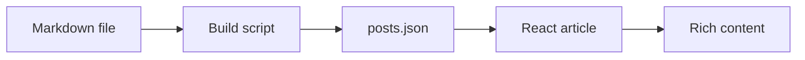

This note verifies the Markdown content pipeline, including code, equations, tables, links, heading anchors, and Mermaid diagrams.

## Code blocks

Inline code looks like `const answer = 42`.

```ts
type Greeting = { name: string }
const greet = ({ name }: Greeting) => `Hello, ${name}!`
console.log(greet({ name: 'Mayegg' }))
```

## Math equations

Inline math: $e^{i\pi} + 1 = 0$.

$$
\sum_{k=1}^{n} k = \frac{n(n+1)}{2}
$$

## Mermaid diagram



## Other elements

> Good notes help your future self understand quickly.

| Feature | Result |
| --- | --- |
| GFM tables | Supported |
| External links | [GitHub profile](https://github.com/Mayeggx) |
| Heading anchors | Supported |

### Conclusion

Add a Markdown file to `posts/`, then run the production build.
