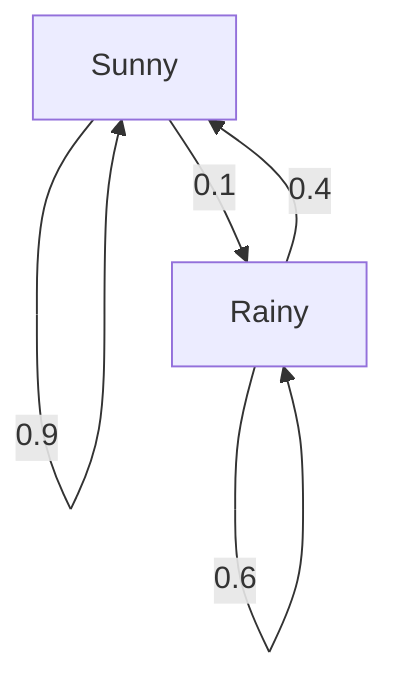
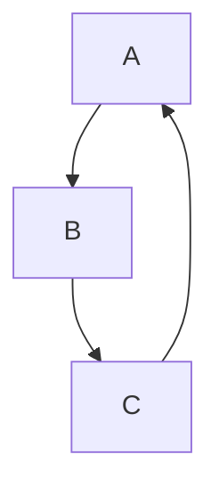
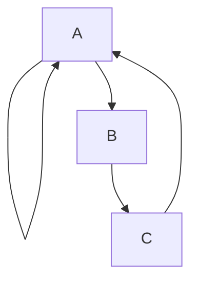
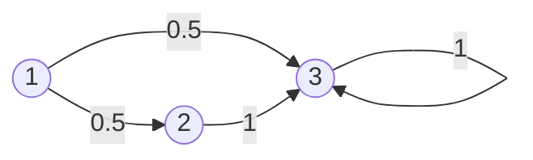
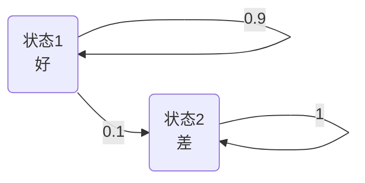
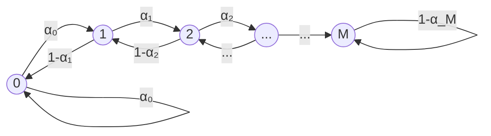
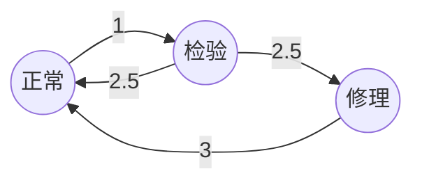

# 马尔可夫链
## 一 离散的马尔可夫

### 核心思想

- 马尔可夫性质：马尔可夫性质，又称为“无记忆性”(Memorylessness)，是马尔可夫过程的核心。它指出，一个随机过程的未来状态的条件概率分布，仅仅取决于其当前状态，而与它在当前状态之前的事件序列无关。
- 离散时间马尔可夫链的定义
	-  **状态空间 (State Space) $S$**: 一个可数集合，包含了所有可能的状态。
	-  **转移概率矩阵 (Transition Probability Matrix) $P$**: 一个方阵，其中元素 $P_{ij}$ 表示从状态 $i$ 转移到状态 $j$ 的单步概率。
	-  **初始概率分布 (Initial Probability Distribution) $\pi_0$**: 一个行向量，表示在时间步 $0$ 时，系统处于各个状态的概率。
- 转移概率矩阵
	- **非负性**: 所有元素 $P_{ij} \ge 0$。
	- **行和为1**: 矩阵的每一行元素之和必须等于 1。这表示从任何一个状态出发，必须转移到状态空间中的某个状态（包括自身）。

#### 示例：天气模型
假设某地的天气只有两种状态：晴天 (Sunny) 和雨天 (Rainy)。状态空间 $S = \{\text{Sunny}, \text{Rainy}\}$。
我们观察到如下转移规律：
-   如果今天晴天，明天有 90% 的概率还是晴天，10% 的概率会下雨。
-   如果今天雨天，明天有 40% 的概率会转晴，60% 的概率会继续下雨。

对应的转移概率矩阵 $P$ 为：

|          | Sunny | Rainy |
| :------- | :---- | :---- |
| **Sunny**| 0.9   | 0.1   |
| **Rainy**| 0.4   | 0.6   |

$$
P = \begin{pmatrix} 0.9 & 0.1 \\ 0.4 & 0.6 \end{pmatrix}
$$

马尔可夫链的行为也可以通过状态转移图来可视化。图中的节点代表状态，带箭头的边代表可能的状态转移，边上的权重则是转移概率。

天气模型的状态转移图如下：

### n步转移概率

**Chapman-Kolmogorov 方程** 给出了计算n步转移概率的通用方法：
对于任意 $n, m \ge 0$ 和任意状态 $i, j$，有
$$
P_{ij}^{(n+m)} = \sum_{k \in S} P_{ik}^{(n)} P_{kj}^{(m)}
$$
该方程表明，从 $i$ 到 $j$ 的 $(n+m)$ 步转移，可以分解为先用 $n$ 步从 $i$ 到某个中间状态 $k$，再用 $m$ 步从 $k$ 到 $j$。

假设某地的天气可以用一个双状态的马尔可夫链来描述，状态集 $S = \{1 (\text{晴天}), 2 (\text{雨天})\}$。
其单步转移概率矩阵为：
$$
P = P^{(1)} = \begin{pmatrix} 0.8 & 0.2 \\ 0.6 & 0.4 \end{pmatrix}
$$
其中 $P_{11}=0.8$ 表示今天晴天，明天也晴天的概率是0.8。$P_{12}=0.2$ 表示今天晴天，明天下雨的概率是0.2，以此类推。

现在我们想计算 **今天晴天，后天也晴天** 的概率，即 $P_{11}^{(2)}$。

根据 Chapman-Kolmogorov 方程 (取 $n=1, m=1, i=1, j=1$):
$$
P_{11}^{(2)} = \sum_{k \in \{1,2\}} P_{1k}^{(1)} P_{k1}^{(1)} = P_{11}^{(1)}P_{11}^{(1)} + P_{12}^{(1)}P_{21}^{(1)}
$$
代入数值：
$$
P_{11}^{(2)} = (0.8)(0.8) + (0.2)(0.6) = 0.64 + 0.12 = 0.76
$$
这个计算的直观解释是：从晴天到两天后的晴天，有两种途径：
1.  晴天 -> 晴天 -> 晴天 (概率 $0.8 \times 0.8 = 0.64$)
2.  晴天 -> 雨天 -> 晴天 (概率 $0.2 \times 0.6 = 0.12$)
将这两种互斥情况的概率相加，得到总概率 $0.64 + 0.12 = 0.76$。

同时，我们也可以通过计算转移矩阵的平方来得到两步转移矩阵 $P^{(2)}$：
$$
P^{(2)} = P^2 = \begin{pmatrix} 0.8 & 0.2 \\ 0.6 & 0.4 \end{pmatrix} \begin{pmatrix} 0.8 & 0.2 \\ 0.6 & 0.4 \end{pmatrix} = \begin{pmatrix} 0.76 & 0.24 \\ 0.72 & 0.28 \end{pmatrix}
$$
$P^{(2)}$ 的第1行第1列元素正是我们计算出的 $P_{11}^{(2)} = 0.76$。

### 可达性与不可约

-   **可达 (Accessible)**: 如果从状态 $i$ 出发，经过有限步（$n \ge 0$）能够到达状态 $j$（即 $P_{ij}^{(n)} > 0$），则称状态 $j$ 从状态 $i$ **可达**，记作 $i \to j$。
-   **互通 (Communicate)**: 如果状态 $i$ 和 $j$ 相互可达（即 $i \to j$ 且 $j \to i$），则称 $i$ 和 $j$ **互通**，记作 $i \leftrightarrow j$。
-  **互通类 (Communicating Class)**: 互通关系将状态空间划分为若干个互通类。同一个类中的所有状态都是相互互通的。
- 如果一个马尔可夫链只包含一个互通类，即链中任意两个状态都是相互互通的，则称该马尔可夫链是**不可约的 (Irreducible)**。否则，称其为**可约的 (Reducible)**。如果不连通就可约。
	-  **判断方法**：检查状态转移图是否为**强连通图**。如果是，则链是不可约的。
	-  **天气模型示例**：由于 Sunny $\leftrightarrow$ Rainy，该链是不可约的。

### 周期性

-   **周期 (Period)**: 状态 $i$ 的周期 $d(i)$ 是所有从 $i$ 出发返回到 $i$ 的步数 $n$ 的最大公约数。$d(i) = \text{gcd}\{n \ge 1 | P_{ii}^{(n)} > 0\}$。
-   **非周期状态 (Aperiodic)**: 如果 $d(i) = 1$，则状态 $i$ 是非周期的。
-   **性质**: 同一个互通类中的所有状态具有相同的周期。因此，我们可以讨论一个不可约马尔可夫链的周期。
-   **判断方法**: 对于一个互通类，只需判断其中一个状态的周期即可。如果一个状态存在自环（即 $P_{ii} > 0$），那么它的周期一定是1，该类就是非周期的。

**示例1**: 考虑以下马尔可夫链：

-   **计算状态 A 的周期**:
    -   从状态 A 出发，可以经过 3 步返回 A (A → B → C → A)。
    -   也可以经过 6 步返回 A (A → B → C → A → B → C → A)。
    -   所有可能返回 A 的步数集合为 $\{3, 6, 9, \dots\}$。
    -   这些步数的最大公约数是 $\text{gcd}(3, 6, 9, \dots) = 3$。
    -   因此，状态 A 的周期 $d(A) = 3$。
-   由于状态 A, B, C 构成一个互通类，所以 $d(A) = d(B) = d(C) = 3$。该马尔可夫链是周期的，周期为 3。

**示例2**:考虑以下马尔可夫链：

- **分析**：
  - 状态 A 可以通过1步回到自身（A→A），所以 $P_{AA}^{(1)} > 0$。
  - 状态 A 也可以通过3步回到自身（A→B→C→A），所以 $P_{AA}^{(3)} > 0$。
  - 继续分析，A 还可以通过4步（A→A→A→A）、5步（A→A→B→C→A）等回到自身。

计算所有可能的步数 $n$，使得 $P_{AA}^{(n)} > 0$，可以发现 $n=1,3,4,5,\ldots$，即 $n \geq 1$ 且 $n \neq 2$。
这些步数的最大公约数是1，因此 $d(A) = 1$。

**结论**：该马尔可夫链是非周期的（aperiodic）。

### 平稳分布

如果一个马尔可夫链的某个概率分布 $\pi$ 使得在经过一次转移后，其概率分布保持不变，那么这个分布 $\pi$ 就被称为**平稳分布**。

平稳分布 $\pi$ 是一个行向量，满足以下条件：
$$
\pi P = \pi
$$
同时，$\pi$ 的所有分量之和必须为 1。

平稳分布揭示了马尔可夫链在长时间运行后的**长期行为**或**稳态特性**。

**存在性与唯一性定理**：对于一个**不可约**且**非周期**的有限状态马尔可夫链，存在唯一的平稳分布 $\pi$。并且，无论初始分布 $\pi_0$ 是什么，当 $n \to \infty$ 时，系统在任意时刻处于状态 $j$ 的概率都会收敛到 $\pi_j$。
$$
\lim_{n \to \infty} P_{ij}^{(n)} = \pi_j, \quad \text{for all } i, j \in S
$$
这意味着，长期来看，系统处于各个状态的概率与初始状态无关。

设平稳分布为 $\pi = [\pi_S, \pi_R]$，其中 $\pi_S$ 是晴天的概率，$\pi_R$ 是雨天的概率。
我们需要解方程组：
$$
[\pi_S, \pi_R] \begin{pmatrix} 0.9 & 0.1 \\ 0.4 & 0.6 \end{pmatrix} = [\pi_S, \pi_R]
$$
以及
$$
\pi_S + \pi_R = 1
$$

展开矩阵乘法得到：
1.  $0.9 \pi_S + 0.4 \pi_R = \pi_S$
2.  $0.1 \pi_S + 0.6 \pi_R = \pi_R$
3.  $\pi_S + \pi_R = 1$

从第一个方程简化得到：$0.4 \pi_R = 0.1 \pi_S \implies \pi_S = 4 \pi_R$。
将其代入第三个方程：$4 \pi_R + \pi_R = 1 \implies 5 \pi_R = 1 \implies \pi_R = 0.2$。
因此，$\pi_S = 4 \times 0.2 = 0.8$。

所以，该天气模型的平稳分布为 $\pi = [0.8, 0.2]$。这意味着，长期来看，这个地方大约有 80% 的日子是晴天，20% 的日子是雨天。

### 吸收马尔可夫链

#### 概念

-   **吸收态 (Absorbing State)**: 如果一个状态 $i$ 一旦进入就无法离开，即 $P_{ii} = 1$，则称状态 $i$ 为吸收态。
-   **吸收马尔可夫链**: 一个马尔可夫链如果至少包含一个吸收态，并且从任意一个非吸收态（暂态）出发，都能在有限步内到达某个吸收态，则称其为吸收马尔可夫链。

假设有三个状态：$1$（暂态）、$2$（暂态）、$3$（吸收态）。转移概率如下：

- 从$1$可以以概率$0.5$转移到$2$，以概率$0.5$转移到$3$；
- 从$2$只能以概率$1$转移到$3$；
- $3$为吸收态，$P_{33}=1$。

对于一个吸收马尔可夫链，我们关心两个核心问题：
1.  从某个暂态出发，最终被各个吸收态吸收的概率是多少？
2.  从某个暂态出发，到达吸收态之前，平均需要经过多少步？

为了分析这些问题，通常将转移矩阵 $P$ 重新排列成标准形式：
$$
P = \begin{pmatrix} Q & R \\ 0 & I \end{pmatrix}
$$
其中：
-   $Q$: 暂态到暂态的转移概率矩阵。
-   $R$: 暂态到吸收态的转移概率矩阵。
-   $0$: 吸收态到暂态的转移概率矩阵（全为0）。
-   $I$: 吸收态到吸收态的转移概率矩阵（单位阵）。

**基本吸收矩阵 (Fundamental Matrix)** $N$ 定义为：
$$
N = (I - Q)^{-1} = I + Q + Q^2 + \dots
$$
矩阵 $N$ 的元素 $N_{ij}$ 表示从暂态 $i$ 出发，在被吸收前，访问暂态 $j$ 的期望次数。

**吸收概率 (Absorption Probabilities)**:
从暂态出发，最终被各个吸收态吸收的概率矩阵 $B$ 可以通过以下公式计算：
$$
B = N R
$$
矩阵 $B$ 的元素 $B_{ij}$ 表示从暂态 $i$ 出发，最终被吸收态 $j$ 吸收的概率。

**到达吸收态的期望步数 (Expected Steps to Absorption)**:
从暂态 $i$ 出发，到达某个吸收态的期望步数 $t_i$ 是矩阵 $N$ 的第 $i$ 行各元素之和。如果 $t$ 是一个列向量，其中每个元素为 $t_i$，则：
$$
t = N \mathbf{1}
$$
其中 $\mathbf{1}$ 是一个全为1的列向量。

#### 例题

有三个状态，$1$（暂态）、$2$（暂态）、$3$（吸收态），转移概率如下：

其转移矩阵 $P$ 为：
$$
P = \begin{pmatrix}
0 & 0.5 & 0.5 \\
0 & 0 & 1 \\
0 & 0 & 1
\end{pmatrix}
$$

将其按标准形式排列，暂态为$1,2$，吸收态为$3$：
$$
P = \begin{pmatrix}
Q & R \\
0 & I
\end{pmatrix}
=
\begin{pmatrix}
0 & 0.5 & 0.5 \\
0 & 0 & 1 \\
0 & 0 & 1
\end{pmatrix}
$$
其中
$$
Q = \begin{pmatrix}
0 & 0.5 \\
0 & 0
\end{pmatrix}, \quad
R = \begin{pmatrix}
0.5 \\
1
\end{pmatrix}, \quad
I = \begin{pmatrix}
1 & 0 \\
0 & 1
\end{pmatrix}
$$

**1. 吸收概率 $B = N R$**

首先计算基本吸收矩阵 $N = (I - Q)^{-1}$：

$$
I - Q = \begin{pmatrix}
1 & -0.5 \\
0 & 1
\end{pmatrix}
$$

其逆矩阵为
$$
N = \begin{pmatrix}
1 & 0.5 \\
0 & 1
\end{pmatrix}
$$

计算 $B = N R$：
$$
B = \begin{pmatrix}
1 & 0.5 \\
0 & 1
\end{pmatrix}
\begin{pmatrix}
0.5 \\
1
\end{pmatrix}
=
\begin{pmatrix}
1 \times 0.5 + 0.5 \times 1 \\
0 \times 0.5 + 1 \times 1
\end{pmatrix}
=
\begin{pmatrix}
1 \\
1
\end{pmatrix}
$$

**结论：**
- 从状态$1$或$2$出发，最终被状态$3$吸收的概率都是$1$。

**2. 到达吸收态的期望步数 $t = N \mathbf{1}$**

$\mathbf{1}$为全1列向量：
$$
\mathbf{1} = \begin{pmatrix} 1 \\ 1 \end{pmatrix}
$$

$$
t = N \mathbf{1} = \begin{pmatrix}
1 & 0.5 \\
0 & 1
\end{pmatrix}
\begin{pmatrix}
1 \\
1
\end{pmatrix}
=
\begin{pmatrix}
1 + 0.5 \\
1
\end{pmatrix}
=
\begin{pmatrix}
1.5 \\
1
\end{pmatrix}
$$

**结论：**
- 从状态$1$出发，平均经过$1.5$步到达吸收态；
- 从状态$2$出发，平均经过$1$步到达吸收态。

## 二 隐马尔可夫链

### 基本概念

1. **马尔可夫链**：序列 ${X_n, n=1,2,\cdots}$，初始状态概率 $p_i = P\{X_1=i\}$。
2. **发射信号**：$S_n$ 表示第 $n$ 个发射信号，满足 $\sum_{s\in\mathscr{S}} p(s|j)=1$，且条件概率：$P\{S_1=s|X_1=j\}=p(s|j),\quad P\{S_n=s|X_1,S_1,\cdots,X_{n-1},S_{n-1},X_n=j\}=p(s|j)$
3. **隐马尔可夫链模型**：信号序列 $S_1,S_2,\cdots$ 可观测，状态序列 $X_1,X_2,\cdots$ 不可观测。

> **形象例子说明：**：假设你在森林里散步，每天的天气有“晴天”和“雨天”两种（这就是马尔可夫链的“状态”）。今天是晴天，明天还是晴天的概率是0.8，变成雨天的概率是0.2。雨天之后，第二天继续下雨的概率是0.6，转晴的概率是0.4。你每天只能看到地上的湿度（比如“干”或“湿”），但不知道真实的天气（状态）。地面干燥时更可能是晴天，地面潮湿时更可能是雨天，但不是绝对的。
>    - **马尔可夫链**：天气的变化过程（晴天/雨天的转移）就是马尔可夫链。
>    - **发射信号**：你每天观测到的地面湿度（干/湿），是由当天的真实天气决定的，但有一定概率出错。
>    - **隐马尔可夫链模型**：你只能看到地面湿度（可观测信号），但真实的天气（状态）对你来说是“隐”的。

### 向前算法

**前向概率** ：$F_n(j)$：$F_n(j) = P\{S^n=s_n, X_n=j\}$。条件概率推导：$P\{X_n=j|S^n=s_n\} = \frac{F_n(j)}{\sum_i F_n(i)}$
2. **前向递推公式**：$F_n(j) = p(s_n|j) \sum_i F_{n-1}(i) P_{i,j}$。初始条件：$F_1(i) = p_i p(s_1|i)$。
3. **观测序列概率**：$P\{S^n=s_n\} = \sum_i F_n(i)$。
4. **原理说明：**： 前向算法的核心思想是利用马尔可夫性和条件独立性，将“到达当前时刻且观测到当前观测序列”的概率递归地分解为前一时刻所有可能状态的概率之和。具体来说，$F_n(j)$ 表示“前$n$个观测已发生，且第$n$步在状态$j$”的概率。由于马尔可夫链的无记忆性，当前状态只依赖于前一状态，当前观测只依赖于当前状态，因此可以递推计算。每一步递推时，先考虑所有可能的前一状态$i$，从$i$转移到$j$的概率乘以前一时刻的概率，再乘以当前状态$j$发射当前观测的概率，最后对所有$i$求和。这种分解大大降低了计算复杂度（从指数级降为线性级），适用于任意长度的观测序列。

---

**例子：天气与地面湿度的HMM前向算法计算**

假设有如下模型：
- 状态：晴天（1）、雨天（2）
- 状态转移概率：
  - 晴$\to$晴：0.8，晴$\to$雨：0.2
  - 雨$\to$晴：0.4，雨$\to$雨：0.6
- 发射概率（观测地面）：
  - 晴天时地面干的概率0.7，湿的概率0.3
  - 雨天时地面干的概率0.2，湿的概率0.8
- 初始概率：$P\{X_1=1\}=0.6$，$P\{X_1=2\}=0.4$
- 观测序列：干、湿、湿

**带入说明：**
- $F_1(1)$ 表示第1天是晴天且观测到“干”的概率，等于初始为晴天的概率乘以晴天时观测到“干”的概率，即 $0.6 \times 0.7$。
- $F_1(2)$ 表示第1天是雨天且观测到“干”的概率，等于初始为雨天的概率乘以雨天时观测到“干”的概率，即 $0.4 \times 0.2$。
- $F_2(1)$ 表示第2天是晴天且观测到“湿”的概率。它等于第2天为晴天时观测到“湿”的概率（0.3），乘以前一天各种可能转移到晴天的概率之和（即前一天是晴天转晴天，或前一天是雨天转晴天），即 $0.3 \times [F_1(1) \times 0.8 + F_1(2) \times 0.4]$。
- $F_2(2)$ 表示第2天是雨天且观测到“湿”的概率。它等于第2天为雨天时观测到“湿”的概率（0.8），乘以前一天各种可能转移到雨天的概率之和（即前一天是晴天转雨天，或前一天是雨天转雨天），即 $0.8 \times [F_1(1) \times 0.2 + F_1(2) \times 0.6]$。
- $F_3(1)$ 和 $F_3(2)$ 的计算方法同理，只是用 $F_2(1)$ 和 $F_2(2)$ 递推。

$$
P\{\text{干,湿,湿}\} = F_3(1) + F_3(2) = 0.039168 + 0.068352 = 0.10752
$$

**什么是观测序列概率？**
观测序列概率是指：在给定模型参数（初始概率、状态转移概率、发射概率）下，生成特定观测序列（如“干、湿、湿”）的总概率。它等于所有可能的隐藏状态路径下，最终产生该观测序列的概率之和。这个值衡量了模型对观测数据的“解释能力”，常用于模型训练（如最大似然估计）和模型比较。

### 例题

如果在一个时段过程处在状态1,独立于过去,在下一 个时段将以概率0.9处在状态1,而将以概率0.1处在状态2.一旦过程处在状态2, 它将永远处在状态2.假设每个时段生产一个产品,当过程处在状态1时,每个生产 的产品以概率0.99达到可接受的质量,而当过程处在状态2时,生产的产品以概率 0.96达到可接受的质量. $(P{X_{1}=1}=0.8)$ .给定生产的前3个产品的相继条件 是 a, u, a

已知：
- 状态2 永远保持状态2；
- 状态1时产品合格概率0.99，不合格概率0.01；
- 状态2时产品合格概率0.96，不合格概率0.04；
- 初始概率 $P\{X_1=1\}=0.8$，$P\{X_1=2\}=0.2$；
- 观测序列为 $a, u, a$（a:合格，u:不合格）。

**1. 前向算法计算 $F_n(j)$**

定义：
- $F_n(j)$：前$n$个观测，且第$n$步在状态$j$的概率。

**初始：观测a**
$$
F_1(1) = 0.8 \times 0.99 = 0.792 \\
F_1(2) = 0.2 \times 0.96 = 0.192
$$

**第2步：观测u**
- $p(u|1)=0.01$，$p(u|2)=0.04$
- $P_{1,1}=0.9$，$P_{1,2}=0.1$，$P_{2,2}=1$

$$
F_2(1) = 0.01 \times [F_1(1) \times 0.9] = 0.01 \times (0.792 \times 0.9) = 0.01 \times 0.7128 = 0.007128 \\
F_2(2) = 0.04 \times [F_1(1) \times 0.1 + F_1(2) \times 1] = 0.04 \times (0.792 \times 0.1 + 0.192) = 0.04 \times (0.0792 + 0.192) = 0.04 \times 0.2712 = 0.010848
$$

**第3步：观测a**
- $p(a|1)=0.99$，$p(a|2)=0.96$

$$
F_3(1) = 0.99 \times [F_2(1) \times 0.9] = 0.99 \times (0.007128 \times 0.9) = 0.99 \times 0.0064152 = 0.006351048 \\
F_3(2) = 0.96 \times [F_2(1) \times 0.1 + F_2(2) \times 1] = 0.96 \times (0.007128 \times 0.1 + 0.010848) = 0.96 \times (0.0007128 + 0.010848) = 0.96 \times 0.0115608 = 0.011098368
$$

**(i) 第3个产品时处于好状态的概率**

$$
P\{X_3=1|S^3\} = \frac{F_3(1)}{F_3(1)+F_3(2)} = \frac{0.006351048}{0.006351048+0.011098368} \approx 0.364
$$

**(ii) $X_4=1$ 的概率**

> **思路说明：**  
> 第4个时刻处于好状态（状态1）的概率，等于第3个时刻处于好状态的概率乘以从1转移到1的概率（0.9），加上第3个时刻处于差状态的概率乘以从2转移到1的概率（为0，因为状态2只能转移到自身）。即：

$$
P\{X_4=1|S^3\} = P\{X_3=1|S^3\} \times 0.9 + P\{X_3=2|S^3\} \times 0 \\
= 0.364 \times 0.9 + (1-0.364) \times 0 = 0.3276
$$

**(iii) 下一个产品合格的概率**

> **思路说明：**  
> 下一个产品合格的概率，等于第4个时刻处于好状态的概率乘以好状态下合格的概率（0.99），加上第4个时刻处于差状态的概率乘以差状态下合格的概率（0.96）。即：

$$
P\{\text{下一个合格}|S^3\} = P\{X_4=1|S^3\} \times 0.99 + P\{X_4=2|S^3\} \times 0.96 \\
= 0.3276 \times 0.99 + (1-0.3276) \times 0.96 \\
= 0.324324 + 0.649504 \\
= 0.973828
$$

**答：**
1. 第3个产品时处于好状态的概率约为0.364；
2. $X_4=1$的概率约为0.328；
3. 下一个产品合格的概率约为0.974。

## 三 时间可逆的马尔可夫

### 核心概念

1. **前提条件**：考察具有转移概率 $P_{ij}$ 和平稳概率 $\pi_i$ 的平稳遍历马尔可夫链。  
2. **逆向过程的马尔可夫性**：  
   从时间 $n$ 倒推，状态序列 $X_n, X_{n-1}, X_{n-2}, \cdots$ 构成马尔可夫链，其转移概率 $Q_{ij}$ 定义为：  
   $$
   Q_{ij} = P\{X_m = j \mid X_{m+1} = i\} = \frac{\pi_j P_{ji}}{\pi_i}
   $$
3. **时间可逆的定义**：若对所有状态 $i, j$，有 $Q_{ij} = P_{ij}$，即满足 $\pi_i P_{ij} = \pi_j P_{ji}$，则称该马尔可夫链时间可逆。  

---

**形象例子说明：**

假设你在一个有三个房间（A、B、C）的屋子里随机走动，每次只能走到相邻的房间。比如：
- 从A到B的概率是0.5，从A到C的概率是0.5；
- 从B到A的概率是0.3，从B到C的概率是0.7；
- 从C到A的概率是0.6，从C到B的概率是0.4。

如果你在屋子里待了很久，最终每个房间的“长期占有概率”分别是$\pi_A$、$\pi_B$、$\pi_C$。时间可逆的意思是：你在屋子里随便抓拍一张照片，不管你是正着走还是倒着走，看到“从A到B”的场景和“从B到A”的场景出现的频率是一样的。也就是$\pi_A P_{AB} = \pi_B P_{BA}$。

更一般地，时间可逆马尔可夫链的本质是：如果你把整个过程录像，然后倒放，别人无法分辨你是在正放还是倒放。这种“正反对称性”就是时间可逆性。

---
### 时间可逆性

对于满足“若 $P_{ji} = 0$ 则 $P_{ij} = 0$”的遍历马尔可夫链，其时间可逆当且仅当：对任意状态 $i, i_1, \cdots, i_k$，从 $i$ 出发回到 $i$ 的任意路径与其反向路径概率相等，即  

$$
P_{i,i_1} P_{i_1,i_2} \cdots P_{i_k,i} = P_{i,i_k} P_{i_k,i_{k-1}} \cdots P_{i_1,i}
$$

想象一辆通勤车在多个城市间穿梭（如路线：A→B→C→A）。时间可逆意味着：  
- **正向开**（A→B→C→A）的概率，等于**倒着开**（A→C→B→A）的概率。  
- 若所有可能环路都满足此条件，则整个系统在统计意义上是“时间对称”的——无法区分时间方向。
---
### 稳态

对不可约马尔可夫链，若存在和为1的正数列 $\pi_i$ 及转移概率矩阵 $Q$ 满足 $\pi_i P_{ij} = \pi_j Q_{ji}$，则 $Q_{ij}$ 为逆向链的转移概率，且 $\pi_i$ 是原链和逆向链的共同平稳概率。  

 **案例：双城通勤的稳态**  
对A、B两城：  
- 设A城常住100万人，B城150万人 → $\pi_A = 0.4$, $\pi_B = 0.6$。  
- 正向转移：$P_{A→B}=0.7$, $P_{B→A}=0.4$。  

**验证细致平衡**：  
$$\pi_A P_{A→B} = 0.4 \times 0.7 = 0.28$$  
$$\pi_B P_{B→A} = 0.6 \times 0.4 = 0.24$$  
**不相等！** → 存在从A→B的净流量（0.04），系统未达稳态。  

**调整概率或人口比例**：  
- 若令 $\pi_A = \frac{4}{11}$, $\pi_B = \frac{7}{11}$，且 $P_{A→B}=0.7$, $P_{B→A}=0.4$，则：  
$$\pi_A P_{A→B} = \frac{4}{11} \times 0.7 = \frac{2.8}{11}$$  
$$\pi_B P_{B→A} = \frac{7}{11} \times 0.4 = \frac{2.8}{11}$$  
**流量平衡！** → $\pi_i$ 是平稳分布，且逆向链 $Q_{B→A} = P_{A→B} \frac{\pi_A}{\pi_B} = 0.7 \times \frac{4/11}{7/11} = 0.4$（与原链一致）。
### 例题

考察状态为 $0,1, \cdots, M$ 和转移概率为
$P_{i, i+1} = \alpha_{i} = 1 - P_{i, i-1},\ i=1, \cdots, M-1,$
$P_{0,1} = \alpha_{0} = 1 - P_{0,0},$
$P_{M, M} = \alpha_{M} = 1 - P_{M, M-1}$的随机游动

**解答与思路说明：**

这是一个有限状态的随机游动模型，状态空间为 $0,1,\cdots,M$，每一步只能向左或向右移动一步，边界状态有特殊转移概率。

**1. 平稳分布的求解思路：**

- 设平稳概率为 $\pi_i$，满足 $\sum_{i=0}^M \pi_i = 1$。
- 利用平衡方程：对于 $i=1,\cdots,M-1$，有
  $$
  \pi_{i-1} \alpha_{i-1} + \pi_{i+1} (1-\alpha_{i+1}) = \pi_i
  $$
  其中 $\alpha_i = P_{i,i+1}$，$1-\alpha_i = P_{i,i-1}$。
- 边界状态 $i=0$ 和 $i=M$ 需单独考虑：
  - $i=0$：$\pi_0 (1-\alpha_0) + \pi_1 (1-\alpha_1) = \pi_0$
  - $i=M$：$\pi_M \alpha_M + \pi_{M-1} \alpha_{M-1} = \pi_M$

**2. 递推公式与归一化：**

- 由详细平衡条件（时间可逆性），有
  $$
  \pi_i \alpha_i = \pi_{i+1} (1-\alpha_{i+1}),\quad i=0,1,\cdots,M-1
  $$
- 可递推得到
  $$
  \pi_{i+1} = \frac{\alpha_i}{1-\alpha_{i+1}} \pi_i
  $$
- 依次递推，得到所有 $\pi_i$ 关于 $\pi_0$ 的表达式，最后用归一化条件 $\sum_{i=0}^M \pi_i = 1$ 求出 $\pi_0$，进而得到全部平稳分布。

**说明：**
  - 平衡方程（又称全概率平衡方程）是指：在平稳状态下，进入某状态$i$的总概率流等于离开该状态的总概率流。
  - 一般形式为：$\sum_j \pi_j P_{ji} = \pi_i$，即“进入$i$的概率流=处于$i$的概率”。
  - 对于本模型，$i$只能从$i-1$（向右）或$i+1$（向左）到达，所以只有两项：$\pi_{i-1} \alpha_{i-1}$（从$i-1$到$i$）和$\pi_{i+1}(1-\alpha_{i+1})$（从$i+1$到$i$）。
  - 使用条件：适用于有限状态、遍历且不可约的马尔可夫链，且转移结构已知。

## 四 连续时间的马尔可夫

### 基本定义与假设

1. **状态空间**：$\mathcal{S} = \{1, \cdots, m\}$（有限状态）  
2. **关键随机变量**：  
   - $X_n$：第 $n$ 次转移后的状态  
   - $Y_n$：第 $n$ 次转移的时间  
   - $T_n$：第 $n-1$ 次与第 $n$ 次转移的间隔时间  
3. **核心假设**：  
   - 当前状态为 $i$ 时，停留时间服从 **指数分布**：$T \sim \text{Exp}(\nu_i)$，参数 $\nu_i$ 称为 **跳出速率**。  
   - 下一状态 $j$ 的转移概率为 $p_{ij}$，且与停留时间独立。  
   - **自身转移被忽略**：$p_{ii} = q_{ii} = 0$（指数分布无记忆性使自身转移无意义）。

想象你在一家医院的急诊室工作，病人可能处于“等待”、“诊断”、“治疗”三种状态。每个病人在某个状态停留一段时间后，会以一定概率转移到下一个状态（比如从“等待”到“诊断”），而每次停留的时间是随机的，且服从指数分布（有“记忆无关性”——等多久都一样）。每种状态有自己的“跳出速率”$\nu_i$，比如“等待”状态下平均每小时有2人被叫号（$\nu_{\text{等待}}=2$），而“诊断”状态下平均每小时有1人完成诊断（$\nu_{\text{诊断}}=1$）。每次转移到哪个下一个状态，是根据概率$p_{ij}$决定的，并且和停留时间无关。

> **泊松过程和连续马尔可夫**：泊松过程是最简单的连续时间马尔可夫链。**泊松过程 = 状态空间为自然数 + 仅单向转移 + 恒定转移速率的CTMC**。 
> - 状态空间为 $\mathbb{N}=\{0,1,2,...\}$，每次只能转移到相邻状态（$i \to i+1$）。 
> - 所有状态的转移速率相同（$q_{i,i+1}=\lambda$，其余 $q_{ij}=0$）。
> - 每个状态的停留时间独立且服从 $\text{Exp}(\lambda)$，与CTMC的定义一致。  

---
### 转移速率与嵌入链

1. **稳态概率 $\pi_j$ 的存在条件**：  
   - 链有 **单个常返类**（所有状态互通）。  
2. **平衡方程组**：  
   - **全局平衡**：$\pi_j \sum_{k \neq j} q_{jk} = \sum_{k \neq j} \pi_k q_{kj}$  
     - 物理意义：**离开状态 $j$ 的总速率 = 进入状态 $j$ 的总速率**。  
   - **归一化条件**：$\sum_{k=1}^m \pi_k = 1$。 

- **稳态概率 $\pi_j$ 的含义：**
  - 比如你长期观察急诊室，$\pi_{\text{等待}}$ 就是病人处于“等待”状态的时间比例，$\pi_{\text{诊断}}$ 是在“诊断”状态的比例，$\pi_{\text{治疗}}$ 是在“治疗”状态的比例。
  - 这些概率反映了系统长期运行后，病人分布在各状态的“平均占比”。
- **平衡方程的物理意义：**
  - 对于每个状态（如“诊断”），系统长期运行后，“进入诊断状态的速率”=“离开诊断状态的速率”。
  - 例如，“诊断”状态的平衡方程为：$\pi_{\text{等待}} q_{\text{等待,诊断}} + \pi_{\text{治疗}} q_{\text{治疗,诊断}} = \pi_{\text{诊断}} (q_{\text{诊断,等待}} + q_{\text{诊断,治疗}})$
    左边是进入诊断的总速率，右边是离开诊断的总速率。
- **归一化条件：** $\pi_{\text{等待}} + \pi_{\text{诊断}} + \pi_{\text{治疗}} = 1$，即所有状态的概率加起来为1。

---
### 稳态性质

- **$\pi_j$**：连续时间链的稳态概率（**时间占比**）。  
- **$\bar{\pi}_j$**：嵌入离散链的稳态概率（**转移次数占比**）。  

- $\pi_{\text{诊断}}$ 表示：如果你在医院里随机选一个时刻，病人在“诊断”状态的概率（即病人在“诊断”状态下花的总时间占比）。
- $\bar{\pi}_{\text{诊断}}$ 表示：如果你只看每次状态变化（不管间隔多久），统计所有转移中有多少次是进入“诊断”状态，所占比例。

---
### 例题

一台运转中的机器会一直工作，直到警告信号产生。从开始工作一直到产生警告信号的时间服从参数为 1 的指数分布。产生警告之后，机器将被检修，检修的时间服从参数为 5 的指数分布。检修结果以 1/2 的概率将机器维修好，此时机器将恢复正常生产；而另一个可能的结果是机器已经损坏（概率为 1/2），机器将送去修理。修理时间服从参数为 3 的指数分布。我们假设前面提到的随机变量都是相互独立的，且独立于检修结果。计算$\pi_j$ 和 $\bar{\pi}_j$ 的值。

转移概率矩阵为
$$
P = \begin{pmatrix}
0 & 1 & 0 \\
\frac{1}{2} & 0 & \frac{1}{2} \\
1 & 0 & 0
\end{pmatrix}
$$

转移速率矩阵 $Q$

$$
Q = \begin{pmatrix}
0 & 1 & 0 \\
2.5 & 0 & 2.5 \\
3 & 0 & 0
\end{pmatrix}
$$

$$
  \pi_1 + \pi_2 + \pi_3 = 5 \pi_2 + \pi_2 + \frac{5}{6} \pi_2 = \frac{41}{6} \pi_2 = 1 
$$

$$
 \pi_2 = \frac{6}{41}, \quad \pi_1 = \frac{30}{41}, \quad \pi_3 = \frac{5}{41}
$$

$$
  \bar{\pi}_1 + \bar{\pi}_2 + \bar{\pi}_3 = \bar{\pi}_1 + \bar{\pi}_1 + \frac{1}{2} \bar{\pi}_1 = \frac{5}{2} \bar{\pi}_1 = 1
$$ 

$$
  \bar{\pi}_1 = \frac{2}{5}, \quad \bar{\pi}_2 = \frac{2}{5}, \quad \bar{\pi}_3 = \frac{1}{5}
$$
- **$\pi_j$（时间占比）**：  机器因 $\nu_1=1$（正常工作停留时间长），故 $\pi_1$ 高达 $\frac{30}{41}$；而检修（$\nu_2=5$）和修理（$\nu_3=3$）时间短，占比低。
- **$\bar{\pi}_j$（转移次数占比）**：  嵌入链忽略停留时间，仅统计转移方向。由于从状态2有一半概率返回状态1（$p_{21}=\frac{1}{2}$），$\bar{\pi}_1$ 和 $\bar{\pi}_2$ 均为 $\frac{2}{5}$。

## 五 半马尔可夫

1. **模型定义**  
   - 过程在状态 $1, 2, \cdots, N$ 间转移，在状态 $i$ 停留时间服从均值为 $\mu_i$ 的分布，然后以概率 $P_{ij}$ 转移到状态 $j$，称为半马尔可夫过程（若停留时间恒为1，则退化为马尔可夫链）。  
   - **长程状态时间比例**：$P_i = \frac{\mu_i \pi_i}{\sum_{j=1}^N \mu_j \pi_j}$，其中 $\pi_i$ 为转移概率矩阵的平稳分布（若存在）。
   - **形象例子：**  想象你有一台机器，它可能处于“良好”“一般”“损坏”三种状态。每次状态变化后，机器在当前状态停留的时间是随机的（比如“良好”状态平均能用10天，“一般”状态平均用3天，“损坏”状态平均修2天），然后根据一定概率转移到下一个状态（比如“良好”用完后80%变“一般”，20%直接“损坏”）。  半马尔可夫过程就是用来描述这种“每个状态停留时间分布不同，转移概率也不同”的系统。  长程状态时间比例$P_i$表示：如果你长期观察这台机器，最终它有多少比例的时间是在“良好”“一般”“损坏”这三种状态中。这个比例不仅和转移概率有关，还和每种状态平均能持续多久有关。

2. **应用案例**  
   - **机器状态模型**：机器在“良好”“不错”“损坏”间转移，各状态停留均值为 $\mu_1, \mu_2, \mu_3$，转移概率已知，则长程处于状态 $i$ 的时间比例为：  
     $$
     P_i = \frac{\mu_i \pi_i}{\mu_1 \pi_1 + \mu_2 \pi_2 + \mu_3 \pi_3}
     $$
     其中 $\pi_i$ 由转移概率矩阵的平稳方程求解。

3. **例题** 考虑一台机器, 它可以处在 3 个状态之一：良好, 不错和损坏. 假设这台机器在良好时将以平均时间 $\mu_1$ 保持这种状态, 然后它分别以概率 3/4 和 1/4 转变为不错和损坏. 这台机器在不错时将以平均时间 $\mu_2$ 保持这种状态, 然后它转变为损坏. 这台机器在损坏时将进行修理, 需要用平均时间 $\mu_3$, 在修复后它分别以概率2/3 和 1/3 转变为良好和不错. 问这台机器在每个状态的时间的比例是多少?

**解答：**

1. **写出转移概率矩阵 $P$：**

设状态1=良好，2=不错，3=损坏，则
$$
P = \begin{pmatrix}
0 & \frac{3}{4} & \frac{1}{4} \\
0 & 0 & 1 \\
\frac{2}{3} & \frac{1}{3} & 0
\end{pmatrix}
$$

2. **求平稳分布 $\pi = (\pi_1, \pi_2, \pi_3)$：**

平稳方程：
$$
\begin{cases}
\pi_1 = \frac{2}{3}\pi_3 \\
\pi_2 = \frac{3}{4}\pi_1 + \frac{1}{3}\pi_3 \\
\pi_3 = \frac{1}{4}\pi_1 + \pi_2 \\
\pi_1 + \pi_2 + \pi_3 = 1
\end{cases}
$$

解得：
- 由$\pi_1 = \frac{2}{3}\pi_3$，$\pi_1 = \frac{2}{3}\pi_3$
- 代入$\pi_2 = \frac{3}{4}\pi_1 + \frac{1}{3}\pi_3$
- 再代入$\pi_3 = \frac{1}{4}\pi_1 + \pi_2$

联立解得
$$
\pi_1 = \frac{2}{9},\quad \pi_2 = \frac{4}{9},\quad \pi_3 = \frac{1}{3}
$$

3. **带入平均停留时间，计算长程时间比例 $P_i$：**

$$
P_i = \frac{\mu_i \pi_i}{\mu_1 \pi_1 + \mu_2 \pi_2 + \mu_3 \pi_3}
$$

即
$$
P_1 = \frac{\mu_1 \cdot \frac{2}{9}}{D},\quad
P_2 = \frac{\mu_2 \cdot \frac{4}{9}}{D},\quad
P_3 = \frac{\mu_3 \cdot \frac{1}{3}}{D}
$$
其中 $D = \mu_1 \frac{2}{9} + \mu_2 \frac{4}{9} + \mu_3 \frac{1}{3}$。
